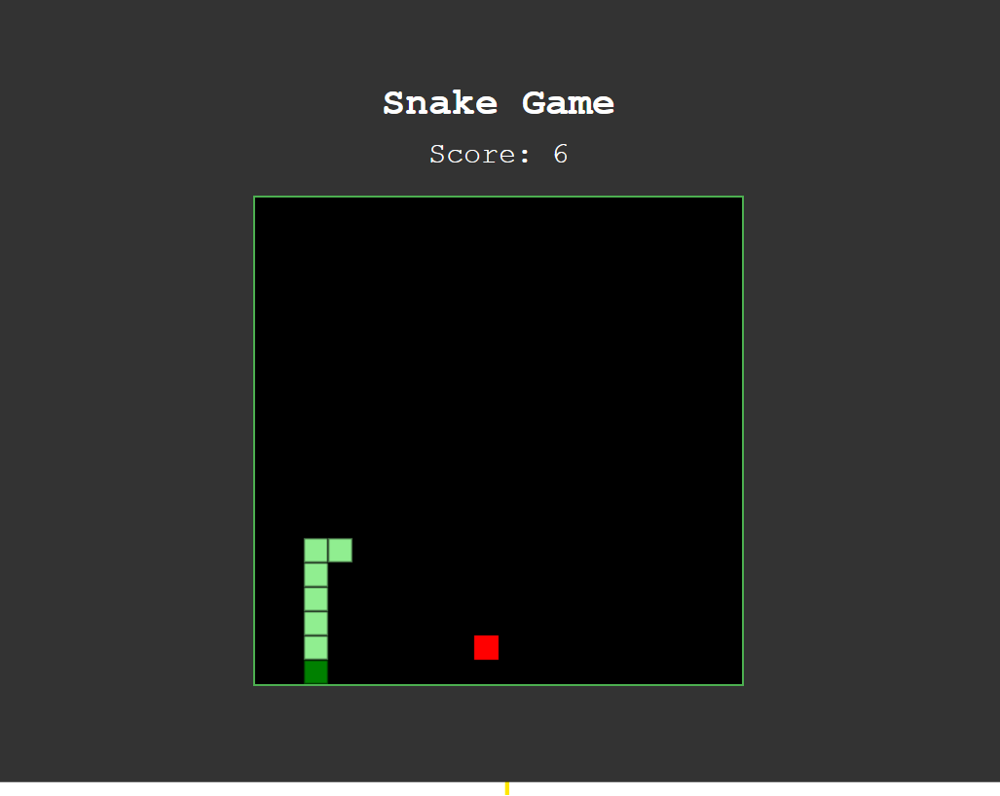

# Snake Game 🐍

A classic implementation of the Snake game built purely with HTML, CSS, and vanilla JavaScript. This project was created as a fun way to practice core JavaScript concepts like the DOM, canvas rendering, and game loops.

## Live Demo 🚀

You can play the game live here:
**[https://singhanshuman11.github.io/Snake-Game/](https://singhanshuman11.github.io/Snake-Game/)**

## Screenshot


*(Note: To make this screenshot appear, take a screenshot of your game, name the file `screenshot.png`, and place it in the root of your project folder.)*

## Features

- Classic snake gameplay
- Score tracking
- Game-over detection for wall and self-collision
- Increasing difficulty as the score rises
- Responsive controls using both Arrow Keys and WASD keys

## Technologies Used

- **HTML5**: For the basic structure of the game.
- **CSS3**: For styling the game canvas and layout.
- **JavaScript (ES6+)**: For all the game logic, including rendering, controls, and rules.

## How to Play

1.  **Start the game**: Open the live link above.
2.  **Control the Snake**: Use the **Arrow Keys** or **WASD** keys to change the snake's direction.
3.  **Objective**: Eat the red food squares (🍎) to grow the snake and increase your score.
4.  **Avoid Collisions**: The game ends if you run into the walls or into the snake's own tail.

## How to Run Locally

1.  Clone the repository:
    ```bash
    git clone [https://github.com/singhanshuman11/Snake-Game.git](https://github.com/singhanshuman11/Snake-Game.git)
    ```
2.  Navigate to the project directory:
    ```bash
    cd Snake-Game
    ```
3.  Open the `index.html` file in your favorite web browser.
